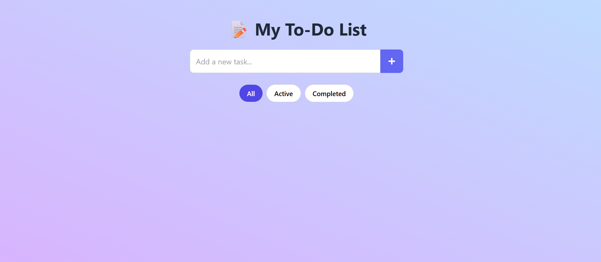

# 📝 To-Do List App

A clean, responsive, and animated **To-Do List App** built using **React**, **Tailwind CSS**, and **React Hot Toast**.  
This app helps users organize tasks efficiently, with filter options and intuitive UI.

---

## 🚀 Features

- ✅ Add, edit, delete tasks
- 🎯 Mark tasks as completed or active
- 🔍 Filter by All, Active, or Completed
- 🌈 Beautiful UI using Tailwind CSS
- ✨ Smooth animations & transitions
- 🔔 Toast notifications using `react-hot-toast`
- 💾 Tasks saved in **localStorage** (persists on refresh)

---

## 📸 Preview

 

---

## 🛠️ Tech Stack

- React.js
- Tailwind CSS
- React Icons
- React Hot Toast

---

## 📂 Folder Structure

my-app/
├── public/
├── src/
│ ├── App.jsx
│ ├── index.js
│ ├── index.css
├── package.json
├── tailwind.config.js


---

## 🔗 Live Demo

👉 [View Live App](https://your-vercel-link.vercel.app)  

---

## 🧑‍💻 Author

**Poojakumari Vijaykumar Prajapati**  
[LinkedIn](https://linkedin.com/in/pooja-prajapati1708) | [GitHub](https://github.com/Poojaprajapati2417)

---

## 📌 How to Run Locally

```bash
git clone https://github.com/Poojaprajapati2417/ToDo-list.git
cd ToDo-list
npm install
npm run dev   # or npm start


ℹ️ Note
This is a frontend-only version of the To-Do app.
Tasks are stored in localStorage. A backend version can be added later if needed.
